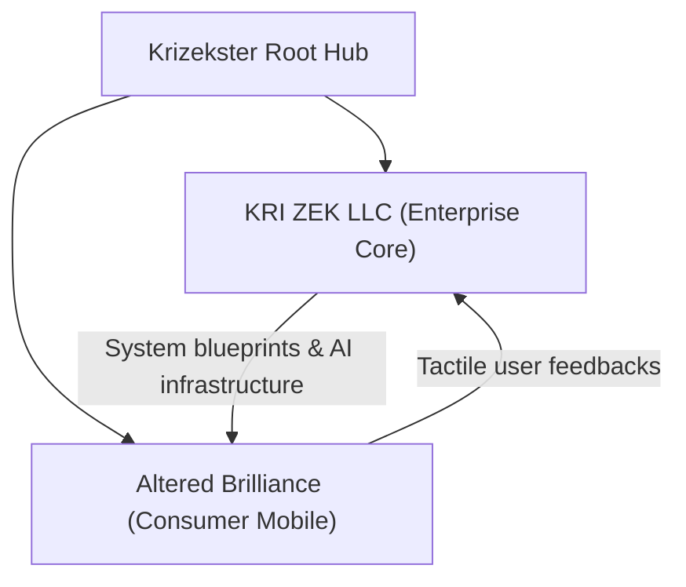

Ecosystem orchestration is the ultimate test of a founder's vision. To build an enterprise that bridges complex B2B corporate capabilities with beautiful, high-performance consumer applications, one must establish an incredibly robust engineering scaffold.

At **KRI ZEK LLC** (USA) and **KRI ZEK INDIA PRIVATE LIMITED**, we operate at the precise intersection of these two tracks:

1. **The Enterprise Track (KRI ZEK):** Engineering high-availability systems, executing Anthropic Partner initiatives, and offering advanced systems consulting for enterprise-grade applications.
2. **The Product Track (Altered Brilliance):** Crafting mobile application ecosystems that deliver highly tactile, fluid consumer interfaces with robust, offline-first sync operations.

## The Dual-Network Symphony

Operating across US and Indian business corridors requires more than just scheduling Zoom calls across time zones. It requires **asynchronous architectural alignment**. 

Exactly like a dual-time mechanical watch (GMT) displaying two zones on a single dial with a single winding gear, our development teams synchronize their engineering workflows through declarative system blueprints. 

By defining strict contracts—whether through OpenAPI schemas, TypeScript types, or robust schema databases—we ensure that B2C mobile applications built by *Altered Brilliance* can draw seamlessly on the heavy-duty corporate infrastructure engineered by *KRI ZEK*.

## Scaling for 2026 and Beyond

As we move deeper into 2026, the boundaries between client-side mobile apps and serverless edge functions are blurring. To maintain high performance, we enforce a strict rule of **zero unnecessary bloat**. 

Every script must justify its byte weight. Every rendering pipeline must be statically compiled wherever possible. 

By deploying Altered Brilliance on highly responsive edge CDNs and utilizing robust native codebases, we ensure that our digital assets are as high-precision and dependable as a certified mechanical chronometer.
